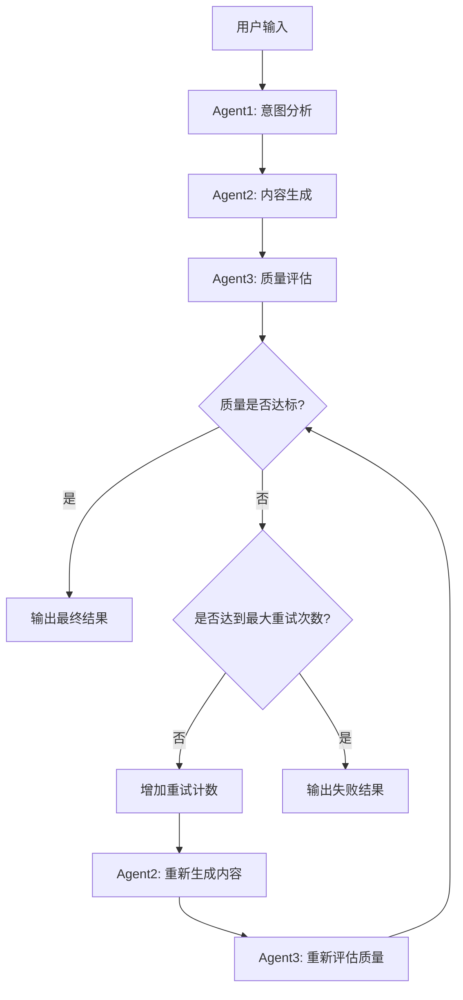

# Mastra智能流程控制系统

基于Mastra框架实现的智能三agent协作workflow系统，支持条件分支和回流控制机制。

## 🎯 系统概述

本系统实现了一个智能的workflow控制系统，通过三个专用Agent的协作，能够智能地处理用户输入，生成高质量内容，并通过质量评估机制确保输出质量。

### 核心特性

- ✅ **三Agent协作架构**：意图分析 → 内容生成 → 质量评估
- ✅ **智能条件分支**：基于质量评估结果的动态流程控制
- ✅ **回流重试机制**：质量不达标时自动重新生成内容
- ✅ **状态管理**：完整的workflow状态跟踪和数据传递
- ✅ **错误处理**：完善的错误处理和降级策略
- ✅ **可配置重试**：支持自定义最大重试次数

## 🏗️ 系统架构

### Agent组件

#### 1. 意图分析Agent (`intentAnalyzerAgent`)
- **职责**：分析用户输入的真实意图，优化提示词
- **输入**：用户原始输入
- **输出**：结构化的意图分析和优化提示词
- **特点**：
  - 识别隐含需求和上下文
  - 生成详细的优化提示词
  - 提供质量评估标准

#### 2. 内容生成Agent (`contentGeneratorAgent`)
- **职责**：基于优化提示词生成高质量内容
- **输入**：优化后的提示词和上下文信息
- **输出**：结构化的生成内容
- **特点**：
  - 严格遵循优化提示词要求
  - 提供置信度评估
  - 包含关键要点和补充信息

#### 3. 质量评估Agent (`qualityEvaluatorAgent`)
- **职责**：评估生成内容的质量，决定是否需要重试
- **输入**：原始输入、优化提示词、生成内容
- **输出**：多维度质量评估结果
- **特点**：
  - 五维度评估（相关性、准确性、完整性、清晰度、实用性）
  - 智能重试建议
  - 具体改进指导

### Workflow流程



## 📁 文件结构

```
mastra/src/mastra/
├── agents/
│   ├── intent-analyzer-agent.ts      # 意图分析Agent
│   ├── content-generator-agent.ts    # 内容生成Agent
│   ├── quality-evaluator-agent.ts    # 质量评估Agent
│   └── weather-agent.ts              # 原有天气Agent
├── workflows/
│   ├── simple-intelligent-workflow.ts # 简化版智能workflow
│   ├── intelligent-workflow.ts        # 完整版智能workflow
│   └── weather-workflow.ts           # 原有天气workflow
└── index.ts                          # Mastra实例配置
```

## 🚀 快速开始

### 1. 环境配置

```bash
# 复制环境变量模板
cp .env.example .env

# 编辑.env文件，添加Google Gemini API密钥
GOOGLE_GENERATIVE_AI_API_KEY=your_api_key_here
```

### 2. 启动开发服务器

```bash
npm run dev
```

### 3. 运行测试

```bash
# 运行完整测试
npx tsx src/run-test.ts

# 或者运行简化测试
npx tsx src/test-simple-workflow.ts
```

## 💡 使用示例

### 基础用法

```typescript
import { mastra } from './mastra/index';

async function runIntelligentWorkflow() {
  const workflow = mastra.getWorkflow('simpleIntelligentWorkflow');
  const run = workflow.createRun();

  const result = await run.start({
    inputData: {
      userInput: '什么是机器学习？',
      maxRetries: 3,
    },
  });

  console.log('执行结果:', result);
}
```

### 输出结果结构

```typescript
{
  success: boolean,           // 是否成功
  userInput: string,          // 用户原始输入
  intentAnalysis: string,     // 意图分析结果
  finalContent: string,       // 最终生成内容
  qualityScore: number,       // 质量分数 (0-10)
  totalRetries: number,       // 总重试次数
  processingTime: string      // 处理时间戳
}
```

## 🔧 技术实现

### 条件分支控制

使用Mastra的`.branch()`方法实现智能条件分支：

```typescript
.branch([
  // 分支1：质量达标
  [
    async ({ inputData }) => {
      return inputData.isQualityAcceptable;
    },
    finalizeResultStep,
  ],
  // 分支2：质量不达标，需要重试
  [
    async ({ inputData }) => {
      return !inputData.isQualityAcceptable && retryCount < maxRetries;
    },
    retryStep,
  ],
])
```

### 状态管理

通过Zod schema确保类型安全的状态传递：

```typescript
const workflowStateSchema = z.object({
  userInput: z.string(),
  maxRetries: z.number(),
  intentAnalysis: intentAnalysisSchema.optional(),
  contentGeneration: contentGenerationSchema.optional(),
  qualityEvaluation: qualityEvaluationSchema.optional(),
});
```

### 错误处理

实现了完善的错误处理和降级策略：

```typescript
try {
  const parsed = JSON.parse(response.text);
  return parsed;
} catch (error) {
  console.error('JSON解析失败，使用默认值');
  return defaultValue;
}
```

## 🎛️ 配置选项

### Agent配置

每个Agent都支持以下配置：

- **model**: LLM模型选择 (默认: `google('gemini-2.5-flash')`)
- **memory**: 记忆存储配置
- **instructions**: 详细的角色指令

### Workflow配置

- **maxRetries**: 最大重试次数 (默认: 3)
- **qualityThreshold**: 质量阈值 (默认: 7.0)
- **timeout**: 执行超时时间

## 📊 性能特点

- **并发处理**: 支持多个workflow实例并发执行
- **内存优化**: 使用流式处理减少内存占用
- **错误恢复**: 自动重试和降级机制
- **类型安全**: 完整的TypeScript类型支持

## 🔍 监控和调试

### 日志记录

系统提供详细的日志记录：

```typescript
logger: new PinoLogger({
  name: 'Mastra',
  level: 'info',
}),
```

### 调试模式

启用调试模式查看详细执行信息：

```bash
MASTRA_LOG_LEVEL=debug npm run dev
```

## 🚧 扩展和定制

### 添加新Agent

1. 创建新的Agent文件
2. 定义输入输出schema
3. 实现execute方法
4. 在index.ts中注册

### 自定义Workflow

1. 创建新的workflow文件
2. 定义步骤和条件分支
3. 实现自定义逻辑
4. 注册到Mastra实例

## 📝 API文档

详细的API文档请参考：
- [Mastra官方文档](https://docs.mastra.ai)
- [Google Gemini API文档](https://ai.google.dev/docs)

## 🤝 贡献指南

欢迎提交Issue和Pull Request来改进这个系统！

## 📄 许可证

MIT License
