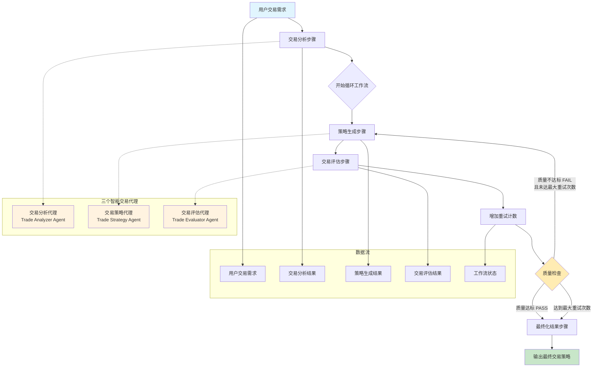

# 智能三代理交易协作工作流总结文档

## 概述

基于现有的 intelligentWorkflow，我们成功创建了一个专门针对交易策略生成和评估的 tradeWorkflow 系统。该系统采用相同的循环工作流架构，通过三个专业化的 AI 代理协作完成交易策略的分析、生成和质量控制任务。

## 工作流架构图



## 核心组件

### 1. 三个智能交易代理

#### 1.1 交易分析代理 (Trade Analyzer Agent)
- **功能**: 分析用户交易需求并优化策略提示词
- **模型**: Google Gemini 2.5 Flash
- **输出格式**: JSON 结构化数据
- **主要职责**:
  - 识别用户的交易意图和风险偏好
  - 将简单交易需求转换为详细的策略提示词
  - 为后续步骤提供交易评估标准

#### 1.2 交易策略代理 (Trade Strategy Agent)
- **功能**: 基于优化策略提示词生成高质量交易方案
- **模型**: Google Gemini 2.5 Flash
- **输出格式**: JSON 结构化数据
- **主要职责**:
  - 根据优化策略提示词生成准确、可执行的交易策略
  - 提供结构化的策略信息输出
  - 支持基于反馈的策略改进

#### 1.3 交易评估代理 (Trade Evaluator Agent)
- **功能**: 评估生成策略的质量并提供改进建议
- **模型**: Google Gemini 2.5 Flash
- **输出格式**: JSON 结构化数据
- **评估维度**:
  - 相关性 (Relevance)
  - 可行性 (Feasibility)
  - 风险控制 (Risk Control)
  - 盈利潜力 (Profit Potential)
  - 实用性 (Usefulness)

### 2. 工作流步骤

#### 2.1 交易分析步骤 (Trade Analysis Step)
- **ID**: `trade-analysis`
- **功能**: 分析用户交易需求并优化策略提示词
- **输入**: 用户原始交易需求
- **输出**: 交易分析结果和优化策略提示词

#### 2.2 策略生成步骤 (Strategy Generation Step)
- **ID**: `strategy-generation`
- **功能**: 基于优化策略提示词生成交易方案
- **输入**: 交易分析结果
- **输出**: 生成的交易策略

#### 2.3 交易评估步骤 (Trade Evaluation Step)
- **ID**: `trade-evaluation`
- **功能**: 评估生成策略的质量
- **输入**: 交易分析结果 + 生成的交易策略
- **输出**: 质量评估结果和改进建议

#### 2.4 最终化步骤 (Trade Finalization Step)
- **ID**: `trade-finalization`
- **功能**: 整理最终交易策略结果
- **输入**: 完整的工作流状态
- **输出**: 最终的交易策略输出

## 文件结构

```
mastra/src/mastra/
├── agents/                          # 代理定义
│   ├── trade-analyzer-agent.ts      # 交易分析代理
│   ├── trade-strategy-agent.ts      # 交易策略代理
│   └── trade-evaluator-agent.ts     # 交易评估代理
├── workflows/                       # 工作流定义
│   ├── trade-workflow.ts           # 主交易工作流
│   ├── trade-types.ts              # 交易相关类型定义
│   └── steps/                      # 步骤实现
│       ├── trade-analysis.ts       # 交易分析步骤
│       ├── strategy-generation.ts  # 策略生成步骤
│       ├── trade-evaluation.ts     # 交易评估步骤
│       └── trade-finalize.ts       # 交易最终化步骤
└── index.ts                        # 主入口（已更新）
```

## 使用示例

```typescript
// 创建交易工作流实例
const workflow = mastra.getWorkflow('tradeWorkflow');
const run = workflow.createRun();

// 执行交易策略生成
const result = await run.start({
  inputData: {
    userInput: '我想做股票短线交易，有什么好的策略？',
    maxRetries: 3,
  },
});

console.log('交易策略结果:', result);
```

## 主要特性

1. **专业化交易代理**: 三个专门针对交易场景设计的 AI 代理
2. **循环质量控制**: 自动重试机制确保策略质量
3. **结构化输出**: 所有结果都采用 JSON 格式，便于后续处理
4. **风险控制导向**: 特别关注风险管理和可行性评估
5. **可扩展架构**: 基于 Mastra 框架，易于扩展和维护

## 与 intelligentWorkflow 的对比

| 特性 | intelligentWorkflow | tradeWorkflow |
|------|-------------------|---------------|
| 应用场景 | 通用内容生成 | 专业交易策略 |
| 代理类型 | 意图分析、内容生成、质量评估 | 交易分析、策略生成、交易评估 |
| 评估维度 | 相关性、准确性、完整性、清晰度、实用性 | 相关性、可行性、风险控制、盈利潜力、实用性 |
| 输出重点 | 信息准确性和完整性 | 策略可执行性和风险控制 |

## 测试

项目包含完整的测试文件 `test-trade-workflow.ts`，包括：
- 单个代理功能测试
- 完整工作流测试
- 多种交易场景测试用例

## 总结

tradeWorkflow 成功复制了 intelligentWorkflow 的架构优势，同时针对交易场景进行了专业化定制。该系统能够：

1. 理解用户的交易需求和风险偏好
2. 生成专业、可执行的交易策略
3. 提供全面的风险评估和质量控制
4. 支持策略的迭代优化

这为用户提供了一个可靠的 AI 驱动的交易策略生成和评估工具。
