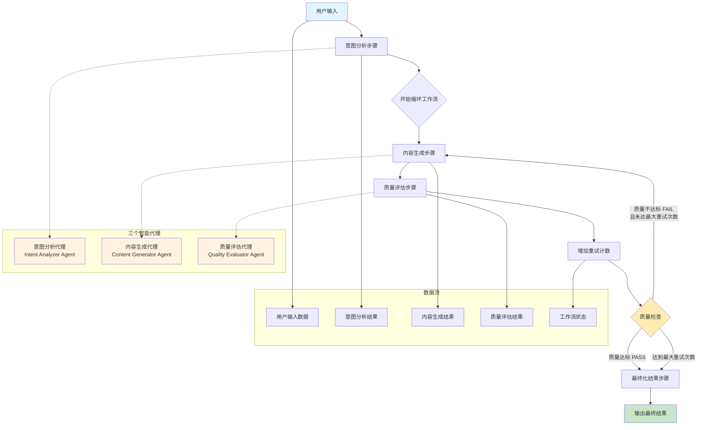

# 智能三代理协作工作流总结文档

## 概述

本项目实现了一个基于 Mastra 框架的智能三代理协作工作流系统，采用循环工作流架构，通过三个专业化的 AI 代理协作完成复杂的内容生成和质量控制任务。

## 工作流架构图



## 核心组件

### 1. 三个智能代理

#### 1.1 意图分析代理 (Intent Analyzer Agent)
- **功能**: 分析用户输入的真实意图并优化提示词
- **模型**: Google Gemini 2.5 Flash
- **输出格式**: JSON 结构化数据
- **主要职责**:
  - 识别用户的隐含需求和上下文
  - 将简单输入转换为详细的提示词
  - 为后续步骤提供质量评估标准

#### 1.2 内容生成代理 (Content Generator Agent)
- **功能**: 基于优化提示词生成高质量内容
- **模型**: Google Gemini 2.5 Flash
- **输出格式**: JSON 结构化数据
- **主要职责**:
  - 根据优化提示词生成准确、详细的内容
  - 提供结构化的信息输出
  - 支持基于反馈的内容改进

#### 1.3 质量评估代理 (Quality Evaluator Agent)
- **功能**: 评估生成内容的质量并提供改进建议
- **模型**: Google Gemini 2.5 Flash
- **输出格式**: JSON 结构化数据
- **评估维度**:
  - 相关性 (Relevance)
  - 准确性 (Accuracy)
  - 完整性 (Completeness)
  - 清晰度 (Clarity)
  - 实用性 (Usefulness)

### 2. 工作流步骤

#### 2.1 意图分析步骤 (Intent Analysis Step)
- **ID**: `intent-analysis`
- **执行**: 一次性执行
- **输入**: 用户原始输入
- **输出**: 工作流状态（包含意图分析结果）

#### 2.2 内容生成步骤 (Content Generation Step)
- **ID**: `content-generation`
- **执行**: 循环执行
- **输入**: 工作流状态（包含意图分析结果）
- **输出**: 工作流状态（包含内容生成结果）

#### 2.3 质量评估步骤 (Quality Evaluation Step)
- **ID**: `quality-evaluation`
- **执行**: 循环执行
- **输入**: 工作流状态（包含内容生成结果）
- **输出**: 工作流状态（包含质量评估结果）

#### 2.4 重试计数步骤 (Increment Retry Step)
- **ID**: `increment-retry`
- **执行**: 循环执行
- **功能**: 增加重试计数器

#### 2.5 最终化结果步骤 (Finalize Result Step)
- **ID**: `finalize-result`
- **执行**: 一次性执行
- **输入**: 工作流状态
- **输出**: 最终结果

## 工作流执行逻辑

### 1. 执行流程

1. **初始化**: 接收用户输入和配置参数
2. **意图分析**: 分析用户意图并优化提示词（一次性）
3. **循环执行**: 
   - 内容生成 → 质量评估 → 重试计数
   - 循环条件: 质量不达标 AND 未达最大重试次数
4. **结果输出**: 整理并输出最终结果

### 2. 循环控制

使用 Mastra 的 `dountil` 循环工作流：
- **停止条件**: `qualityPass OR maxRetriesReached`
- **质量达标标准**: 平均分 ≥ 7.0 分
- **最大重试次数**: 默认 3 次（可配置）

### 3. 数据流转

```
用户输入 → 意图分析结果 → 内容生成结果 → 质量评估结果 → 最终输出
```

## 配置参数

### 默认配置
- **最大重试次数**: 3
- **质量通过阈值**: 7.0
- **超时设置**:
  - 意图分析: 30秒
  - 内容生成: 60秒
  - 质量评估: 30秒

### 环境变量支持
- `WORKFLOW_MAX_RETRIES`: 覆盖最大重试次数
- `WORKFLOW_QUALITY_THRESHOLD`: 覆盖质量阈值
- `WORKFLOW_LOG_LEVEL`: 设置日志级别

## 技术特点

### 1. 架构优势
- **模块化设计**: 业务逻辑与工作流配置分离
- **循环优化**: 使用 dountil 替代复杂分支逻辑
- **状态管理**: 统一的工作流状态管理
- **错误处理**: 完善的异常处理和降级机制

### 2. 数据结构
- **类型安全**: 使用 Zod 进行数据验证
- **结构化输出**: 所有代理输出标准化 JSON 格式
- **状态追踪**: 完整的执行状态和重试信息

### 3. 质量保证
- **多维度评估**: 5个维度的质量评估
- **自动重试**: 基于质量评估的智能重试
- **反馈循环**: 质量评估结果指导内容改进

## 文件结构

```
mastra/src/mastra/
├── agents/                     # 代理定义
│   ├── intent-analyzer-agent.ts
│   ├── content-generator-agent.ts
│   └── quality-evaluator-agent.ts
├── workflows/                  # 工作流定义
│   ├── intelligent-workflow.ts # 主工作流
│   ├── types.ts               # 类型定义
│   ├── config.ts              # 配置管理
│   └── steps/                 # 步骤实现
│       ├── index.ts
│       ├── intent-analysis.ts
│       ├── content-generation.ts
│       ├── quality-evaluation.ts
│       └── retry-and-finalize.ts
└── index.ts                   # 主入口
```

## 使用示例

```typescript
// 创建工作流实例
const workflow = mastra.getWorkflow('intelligentWorkflow');
const run = workflow.createRun();

// 执行工作流
const result = await run.start({
  inputData: {
    userInput: '什么是机器学习？',
    maxRetries: 3,
  },
});

console.log(result);
```

## 总结

该工作流系统成功实现了：
- 智能化的用户意图理解和提示词优化
- 高质量的内容生成和自动质量控制
- 灵活的重试机制和错误处理
- 模块化、可维护的代码架构
- 完整的类型安全和数据验证

这是一个生产就绪的 AI 协作系统，可以处理各种复杂的内容生成任务，并确保输出质量的一致性和可靠性。
